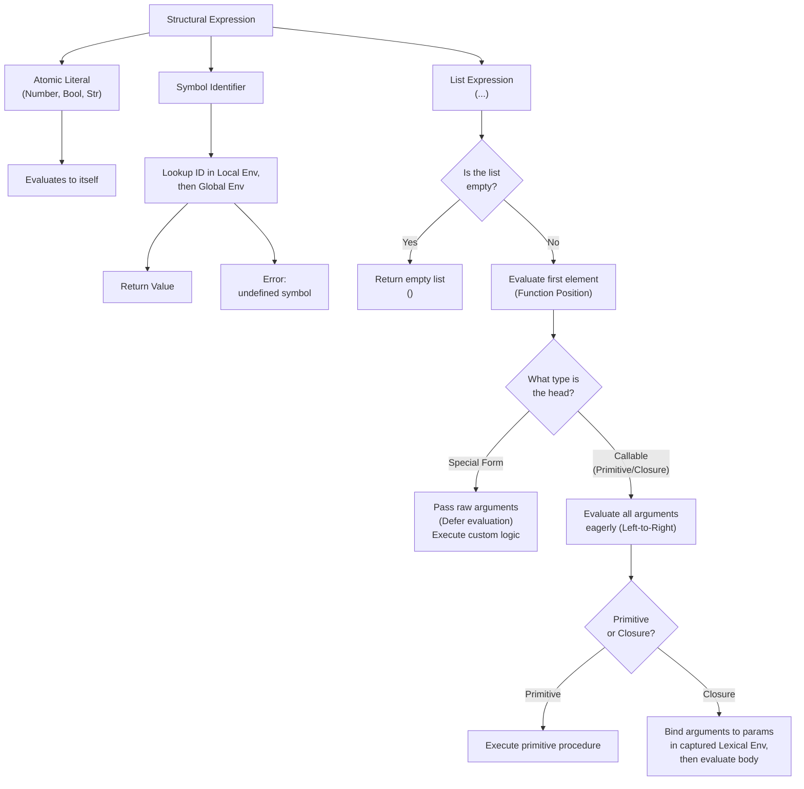

# Crisp Language Specification

Crisp is a minimalist, expression-oriented, eagerly evaluated Lisp-like language.

Everything not specified in the language specification is implementation-defined.

## Syntax & Grammar

Crisp code consists of a sequence of S-expressions in form of lists, separated by whitespaces. Comments begin with `;` and continue until the end of the line.

### Formal EBNF Grammar

```ebnf
(* The Top-Level Structure *)
program    = { expression } ;
expression = atom | list | quoted ;

(* The Core Containers *)
list       = "(" , { expression } , ")" ;
quoted     = "'" , expression ;

(* The Building Blocks (Atoms) *)
atom       = number | boolean | string | symbol ;

(* Atomic Definitions *)
number     = [ "-" ] , digit , { digit } , [ "." , digit , { digit } ] ;
boolean    = "#t" | "#f" ;
string     = '"' , { character - '"' } , '"' ;
symbol     = symbol_char , { symbol_char | digit } ;

(* Character Sets *)
digit       = "0" | "1" | "2" | "3" | "4" | "5" | "6" | "7" | "8" | "9" ;
symbol_char = "a"..."z" | "A"..."Z" | "+" | "-" | "*" | "/" | ">" | "<" | "=" | "!" | "?" | "_" ;
whitespace  = " " | "\n" | "\r" | "\t" ;
comment     = ";" , { character - "\n" } , "\n" ;
```

### Lexical Nuances

- **Negative Numbers vs Symbols:** A single isolated `-` is categorized as a symbol. When followed immediately by a digit (e.g., `-5`), it is greedily parsed as a negative number.
- **String Literals:** Strings do not currently resolve internal escape sequences (`\n`, `\"`). Characters between double quotes are collected raw.

## Evaluation Model

The interpreter executes expressions using an eager, call-by-value tree-walk strategy operating over an explicit environment.

### Operational Rules



1. **Atomic Constants:** Number, boolean, and string literals evaluate to themselves.
2. **Empty Lists:** An empty list with the form `()` evaluates to itself.
3. **Symbols:** Symbols are resolved according to lexical scope. If no binding exists for a symbol, evaluation fails with an undefined symbol error.
4. **Lists with Content:** When evaluating `(Function-Expression Argument-Expressions...)`:
    * `Function-Expression` evaluates first.
    * If it evaluates to a **Special Form**, argument evaluation is deferred. The raw list expressions are passed down directly.
    * If it evaluates to a **Procedure** (Primitives or Closures), all arguments are evaluated sequentially from left to right.

## List Representation

Crisp supports only proper lists.

Lists are represented as finite sequences of values. Improper lists and dotted-pair notation are not supported.

Examples:

```cl
(list 1 2 3)
; => (1 2 3)

(cons 1 '(2 3))
; => (1 2 3)

(cons 1 2)
; runtime error
```

## Special Forms

Special forms handle language scaffolding that behave like functions that control evaluation.

### `quote`

- **Syntax:** `(quote <expression>)` or `'<expression>`
- **Semantics:** Returns its argument without evaluation.

### `define`

- **Syntax:** `(define <symbol> <expression>)`
- **Semantics:** Evaluates `<expression>` in the active context, then injects or replaces the binding of `<symbol>` directly inside the **Global Environment**.
- **Constraints:** `<symbol>` must be a pure identifier token, not a sub-expression.

### `if`

- **Syntax:** `(if <test-expression> <consequent> <alternate>)`
- **Semantics:** Eagerly evaluates `<test-expression>`.
- If the result corresponds to `#f`, `<consequent>` is completely ignored, and `<alternate>` evaluates.
- Any non-`#f` value (including numbers, strings, and `#t`) is treated as truthy, triggering evaluation of `<consequent>`.

### `lambda`

- **Syntax:** `(lambda (<symbol-arguments>...) <body>)`
- **Semantics:** Creates a first-class function that captures the lexical environment in which it was defined.

### `let`

- **Syntax:** `(let ((<symbol_1> <expr_1>) (<symbol_2> <expr_2>) ...) <body>)`
- **Semantics:** Provides local lexical scopes. Crisp implements sequential evaluation mechanics inside bindings (similar to Scheme's `let*`). Each individual assignment expression evaluates in an environment containing the evaluations of all preceding bindings defined above it.
* **Example:**
```cl
(let ((x 2)
      (y (* x 5)))
  (+ x y))

; => 12
```

## Built-in Primitives

Primitives are standard procedures embedded inside the initial environment. Arguments undergo eager evaluation before execution.

### Arithmetic Operations

| Primitive | Expected Arguments | Types | Semantics |
| --- | --- | --- | --- |
| `+` | Variable-length ($\ge 0$) | Numbers | Returns the cumulative sum. `(+)` returns `0`. |
| `-` | Variable-length ($\ge 1$) | Numbers | Single arg: negates it. Multiple args: Subtracts items 2..N from the first. |
| `*` | Variable-length ($\ge 0$) | Numbers | Returns cumulative product. `(*)` returns `1`. |
| `/` | Variable-length ($\ge 1$) | Numbers | Single arg: divides 1 by value. Multiple args: Sequentially divides item 1 by items 2..N. |

> [!WARNING]
> Division operations check for zero invariants (`0` or `0.0`). Triggering a zero denominator halts execution with an "divide by zero" exception.

### Relational and Comparison Operators

| Primitive | Expected Arguments | Types | Semantics |
| --- | --- | --- | --- |
| `=` | 2 | Numbers | Returns `#t` if numeric values match exactly, else `#f`. |
| `<` | 2 | Numbers | Returns `#t` if the first number is strictly less than the second. |
| `>` | 2 | Numbers | Returns `#t` if the first number is strictly greater than the second. |
| `<=` | 2 | Numbers | Returns `#t` if the first number is less than or equal to the second. |
| `>=` | 2 | Numbers | Returns `#t` if the first number is greater than or equal to the second. |
| `equal?` | 2 | Any | Returns `#t` when both arguments are structurally equal and have the same type, otherwise `#f`. |

> [!NOTE]
> `equal?` supports numbers, booleans, strings, and lists. Function values are not comparable and always evaluate as unequal.

### List Manipulation Mechanics

| Primitive | Expected Arguments | Types | Semantics |
| --- | --- | --- | --- |
| `cons` | 2 | Value, List | Prepends the first element to the front of the second argument list. |
| `car` | 1 | Non-empty List | Unwraps and returns the head node of the collection. |
| `cdr` | 1 | Non-empty List | Returns a collection containing all trailing items after the head node. |
| `list` | Variable-length ($\ge 0$) | Any | Gathers individual inputs into an encapsulated list. |
| `null?` | 1 | List | Returns `#t` if the structure is an empty collection list `()`. |

### Boolean Operators & System Primitives

| Primitive | Expected Arguments | Types | Semantics |
| --- | --- | --- | --- |
| `not` | 1 | Boolean | Boolean inversion. |
| `display` | 1 | Any | Prints its argument to the standard output. |
