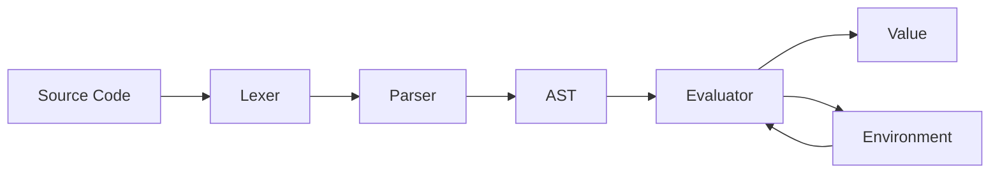

# Crisp

Crisp is a small Lisp-inspired language and interpreter written in Haskell.

## Motivation

While working on the assembler for [BF-CPU](https://github.com/P1X3R/brainfuck-machine), I became curious about how modern programming language implementations work, so I decided to learn the way I enjoy most: by building one.

### Why Haskell

I already had some experience with Haskell through some small experiments, so I also took this project as an opportunity to learn a new language and a completely different programming paradigm. Now I truly believe that Haskell and OCaml are the best languages to write other languages.

## Example

```cl
(define fact
  (lambda (n)
    (if (= n 0)
        1
        (* n (fact (- n 1))))))

(fact 5)
; => 120
```

## Features

* Expression-oriented language
* Lexical scoping
* First-class functions and closures
* Local bindings through `let`
* Quoted expressions
* Interactive REPL
* File execution
* Structured error reporting with source locations
* Golden and property-based tests

## Language Features

### Functions

```cl
(define square
  (lambda (x)
    (* x x)))

(square 5)
; => 25
```

### Conditionals

```cl
(if (> 5 3)
    "yes"
    "no")
```

### Local Bindings

```cl
(let ((x 10)
      (y 20))
  (+ x y))

; => 30
```

### Closures

```cl
(define make-adder
  (lambda (x)
    (lambda (y)
      (+ x y))))

(define add5 (make-adder 5))

(add5 3)
; => 8
```

## Architecture

The interpreter follows a traditional tree-walk architecture:



The evaluator uses eager (call-by-value) evaluation and lexical scoping. Functions are represented as closures that capture the environment in which they were defined.

## Language Specification

See [LANGUAGE.md](LANGUAGE.md) for the complete language specification.

## Building

```sh
stack build
```

## Usage

### REPL

Start a new session:

```sh
stack run
```

Example:

```text
crisp> (+ 2 3)
5

crisp> (define square (lambda (x) (* x x)))

crisp> (square 8)
64

crisp> ,q
Bye!
```

### Running Files

Execute a Crisp source file:

```sh
stack run -- examples/factorial.crisp
```

Example program:

```cl
(define fact
  (lambda (n)
    (if (= n 0)
        1
        (* n (fact (- n 1))))))

(fact 5)
```

Output:

```text
120
```
## Goals

Crisp was created as an exploration of language implementation, parser construction, and interpreter architecture.

The project prioritizes simplicity and educational value over language completeness or runtime performance.

## Design Decisions & Trade-offs

### Evaluation Effects as Values

Most Lisp interpreters execute side effects immediately when special forms such as `define` or procedures such as `display` are evaluated.

Crisp instead models these operations as explicit values:

* `define` produces a `<binding>` value.
* `display` produces a `<print>` value.

These values are later consumed by an evaluation boundary (such as the REPL or sequential program evaluation).

This makes evaluation effects explicit values that can be stored, delayed, and potentially transformed before execution. This also moves the side-effect concern from the evaluator (which benefits from being pure in languages like Haskell) to another place.

The tradeoff is additional complexity to the runtime model and the introduction of value types that do not exist in traditional Lisp systems.

### Tree-Walk Evaluation

Crisp uses a traditional tree-walk interpreter rather than compiling source code to bytecode.

This keeps the implementation extremely simple, making evaluation behavior directly traceable to the abstract syntax tree.

The trade-off is a lower runtime performance compared to other methods (bytecode VM or compilation).

### Eager Evaluation

Function arguments are evaluated before function application.

This significantly simplifies the runtime model.

The trade-off is that Crisp cannot express lazy evaluation patterns without additional language features.

### Lexical Scoping and Closures

Functions capture the environment in which they are defined.

This allows closures to behave predictably and matches the behavior of Scheme-family languages.

The trade-off is additional complexity in the environment management (in this case, keeping a local and global envirionments).

### Sequential `let` Bindings

`let` bindings are evaluated sequentially, similar to Scheme's `let*`.

```cl
(let ((x 2)
      (y (* x 5)))
  (+ x y))
```

Later bindings may reference earlier ones within the same binding block.

This approach is often more convenient and simpler to implement, but differs from the simultaneous binding semantics of traditional `let`.

### Proper Lists Only

Crisp supports only proper lists and does not expose dotted pairs or improper lists.

This significantly simplifies list manipulation, equality checking, and runtime representation.

The trade-off is reduced compatibility with some traditional Lisp techniques that rely on arbitrary cons-cell structures.

## Testing

The interpreter is tested through:

* Golden tests for language behavior
* Property-based tests using Hedgehog
* Additional unit tests for lexer and parser

## Development

This project uses Git Cliff for changelog generation and follows Conventional Commits.

## License

BSD-3-Clause. See LICENSE for details.
