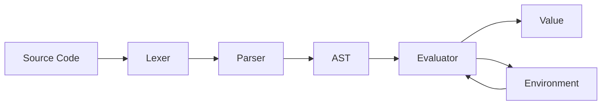

# Crisp

Crisp is a small Lisp-inspired language and interpreter written in Haskell.

## Motivation

While working on the assembler for [BF-CPU](https://github.com/P1X3R/brainfuck-machine), I became curious about how modern programming language implementations work, so I decided to learn the way I enjoy most: by building one.

### Why Haskell

I already had some experience with Haskell through some small experiments, so I also took this project as an opportunity to learn a new language and a completely different programming paradigm. Now I truly believe that Haskell and OCaml are the best languages to write other languages.

## Example

```cl
(define fact
  (lambda (n)
    (if (= n 0)
        1
        (* n (fact (- n 1))))))

(fact 5)
; => 120
```

## Features

* Expression-oriented language
* Lexical scoping
* First-class functions and closures
* Local bindings through `let`
* Quoted expressions
* Interactive REPL
* File execution
* Structured error reporting with source locations
* Golden and property-based tests

## Language Features

### Functions

```cl
(define square
  (lambda (x)
    (* x x)))

(square 5)
; => 25
```

### Conditionals

```cl
(if (> 5 3)
    "yes"
    "no")
```

### Local Bindings

```cl
(let ((x 10)
      (y 20))
  (+ x y))

; => 30
```

### Closures

```cl
(define make-adder
  (lambda (x)
    (lambda (y)
      (+ x y))))

(define add5 (make-adder 5))

(add5 3)
; => 8
```

## Architecture

The interpreter follows a traditional tree-walk architecture:



The evaluator uses eager (call-by-value) evaluation and lexical scoping. Functions are represented as closures that capture the environment in which they were defined.

## Language Specification

See [LANGUAGE.md](LANGUAGE.md) for the complete language specification.

## Building

```sh
stack build
```

## Usage

### REPL

Start a new session:

```sh
stack run
```

Example:

```text
> (+ 2 3)
5

> (define square (lambda (x) (* x x)))

> (square 8)
64

> ,q
Bye!
```

### Running Files

Execute a Crisp source file:

```sh
stack run -- examples/factorial.crisp
```

Example program:

```cl
(define fact
  (lambda (n)
    (if (= n 0)
        1
        (* n (fact (- n 1))))))

(fact 5)
```

Output:

```text
120
```
## Goals

Crisp was created as an exploration of language implementation, parser construction, and interpreter architecture.

The project prioritizes simplicity and educational value over language completeness or runtime performance.

## Testing

The interpreter is tested through:

* Golden tests for language behavior
* Property-based tests using Hedgehog
* Additional unit tests for lexer and parser

## Development

This project uses Git Cliff for changelog generation and follows Conventional Commits.

## License

BSD-3-Clause. See LICENSE for details.
